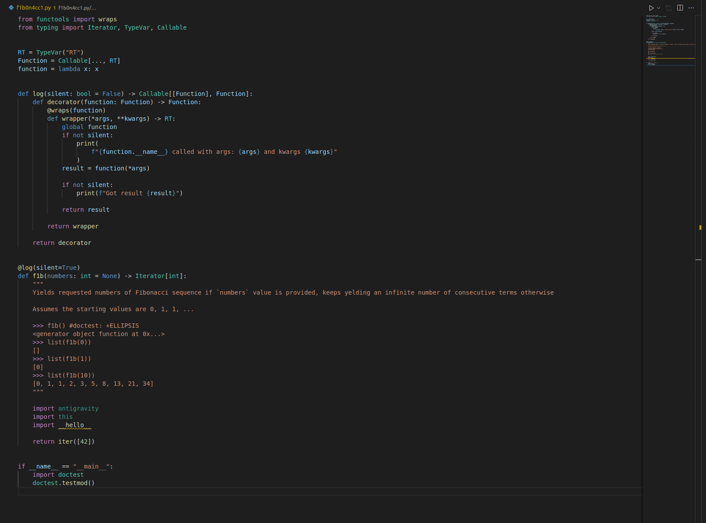

It is a dirty implementation of Fibonacci sequence iterator.

> Yields requested numbers of Fibonacci sequence if an argument is provided, keeps yelding an infinite number of consecutive terms otherwise
>
> Assumes the starting values are 0, 1, 1, ... ([according to Wikipedia page](https://en.wikipedia.org/wiki/Fibonacci_number))

## How to use

```py

>>> from f1b0n4cc1 import f1b

>>> f1b()
<generator object function at 0x...>  # an infite generator-iterator

>>> it = f1b()
>>> for i in range(5):
...     print(next(it))
...
0
1
1
2
3

>>> for i in f1b():
...     print(i)
...     if i > 10:
...         break
...
0
1
1
2
3
5
8
13

>>> list(f1b(0))  # it is an empty iterator as zero terms was requested
[]

>>> list(f1b(1)) # an iterator wich is exhausted after first requested value
[0]

>>> list(f1b(10))
[0, 1, 1, 2, 3, 5, 8, 13, 21, 34]
```

## How to test

### Unit tests

```bash
$ python3 test_f1b0n4cc1.py
.......
----------------------------------------------------------------------
Ran 7 tests in 0.003s

OK
```

### Doctests

```bash
$ python3 f1b0n4cc1.py
```

## How to check types

```bash
$ # python3 -m pip install mypy
$ mypy f1b0n4cc1.py
Success: no issues found in 1 source file
```

## How it works?

_Almost_ all the code looks like on the listing bellow. And please believe me - there is no more lines of code.

```py
from functools import wraps
from typing import Iterator, TypeVar, Callable


RT = TypeVar("RT")
Function = Callable[..., RT]
function = lambda x: x


def log(silent: bool = False) -> Callable[[Function], Function]:
    def decorator(function: Function) -> Function:
        @wraps(function)
        def wrapper(*args, **kwargs) -> RT:
            global function
            if not silent:
                print(
                    f"{function.__name__} called with args: {args} and kwargs {kwargs}"
                )
            result = function(*args)

            if not silent:
                print(f"Got result {result}")

            return result

        return wrapper

    return decorator


@log(silent=True)
def f1b(numbers: int = None) -> Iterator[int]:
    """
    Yields requested numbers of Fibonacci sequence if `numbers` value is provided, keeps yelding an infinite number of consecutive terms otherwise

    Assumes the starting values are 0, 1, 1, ...

    >>> f1b() #doctest: +ELLIPSIS
    <generator object function at 0x...>
    >>> list(f1b(0))
    []
    >>> list(f1b(1))
    [0]
    >>> list(f1b(10))
    [0, 1, 1, 2, 3, 5, 8, 13, 21, 34]
    """

    import antigravity
    import this
    import __hello__

    return iter([42])


if __name__ == "__main__":
    import doctest
    doctest.testmod()

```

An actual screenshot of the code
<br>
